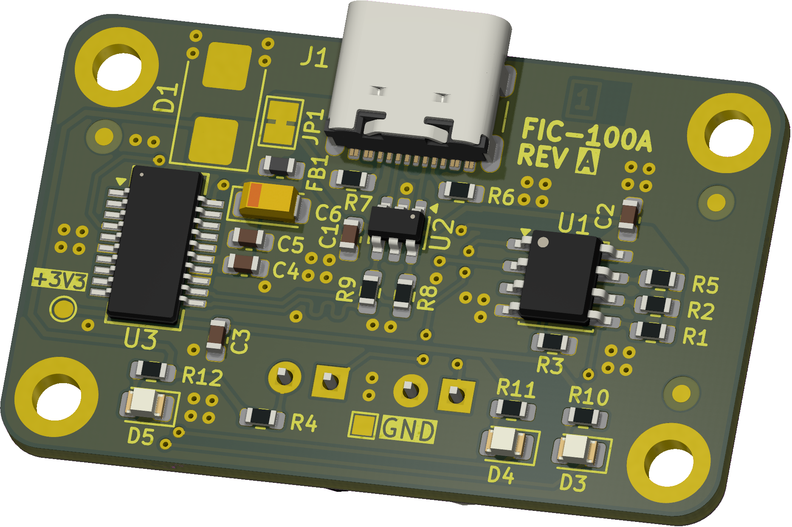
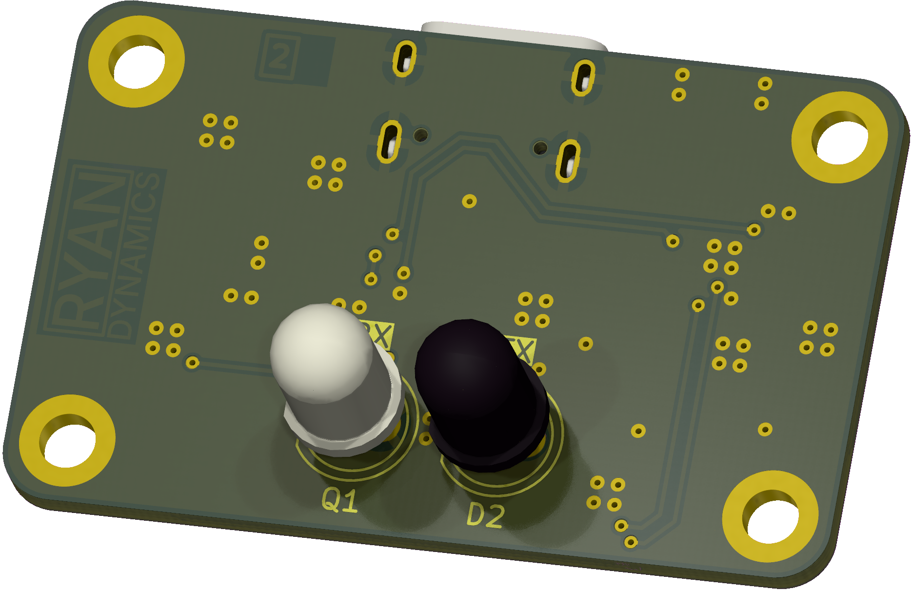

  

<h1 align="center">FIC-100A</h1>

  
&nbsp; &nbsp; &nbsp; &nbsp;
  

***

## SPECIFICATIONS

| Parameter | Value | 
| --- | --- |
| Revision | 0.1.3 |
| Board revision | A |
| Release version | 0.1.3 |
| Variant | RELEASED |
| Dimensions | 40.0 x 25.0 mm |

***

## OUTPUTS

Generated manufacturing, schematic, test, and release packages are published
as CI artifacts and GitHub Release assets. The repository source tree remains
the KiCad project and Boardwright workflow configuration.

***

## LEGAL

This repository contains open hardware design files, protected project branding,
and third-party workflow content.

- The primary hardware licence is listed in `LICENSE`.
- Project-specific scope notes, branding exclusions, compatibility wording,
  non-affiliation wording, and safety notes are in `NOTICE.md`.
- Third-party copyright and licence notices are preserved in
  `THIRD_PARTY_NOTICES.md`.
